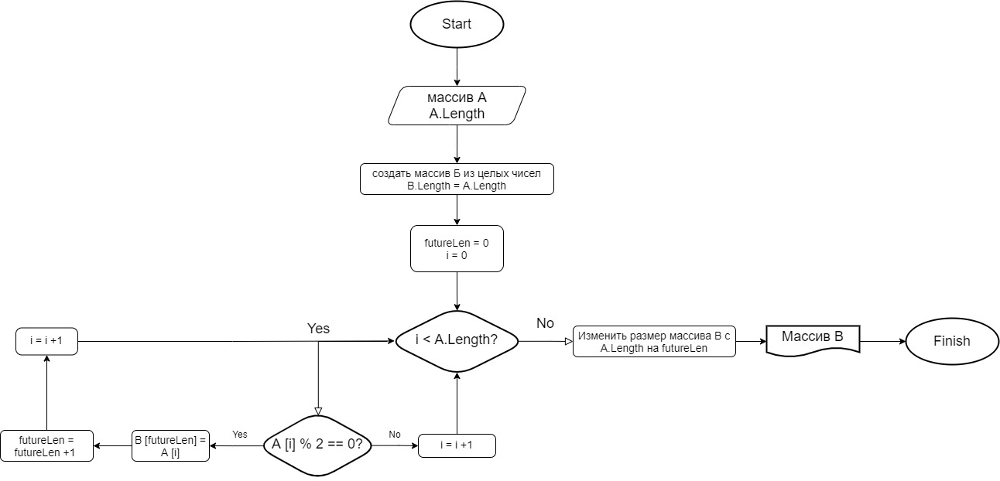

# Контрольная работа #

В репозитории контрольная работа по материалу первой четверти курса "Разработчик" Geekbrains (общий блок).

Краткое описание задачи: написать программу (алгоритм в блок-схеме и код на с#), которая создает из целочисленного массива **А** массив **B**, содержащий только *четные* числа из массива А. Полный текст задачи в файле *Task.md*.

Ниже блок-схема алгоритма, по которому идет отбор чисел в массив **B**. В файле *Program.cs* - полный код программы.

